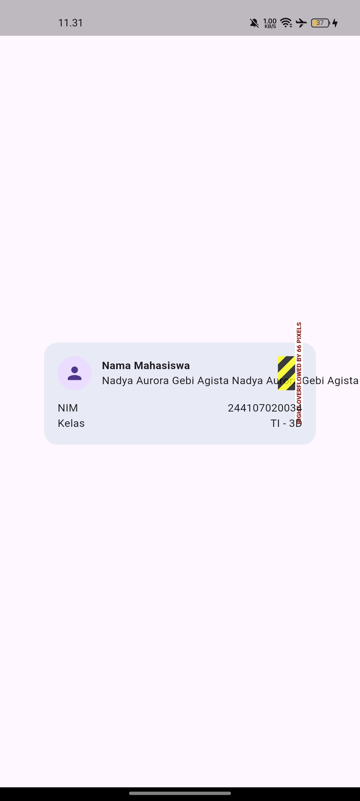
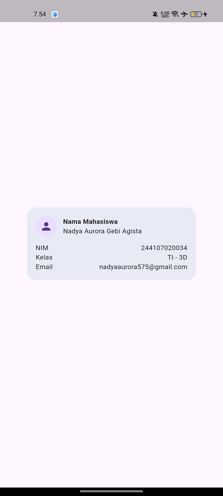
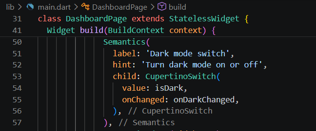

## Tugas Praktikum Minggu 2: Responsive Dashboard
---
**Nama  :** Nadya Aurora Gebi Agista

**NIM   :** 244107020034

---
### Widget Dasar
- `StatelessWidget` digunakan ketika tampilan hanya bergantung pada konfigurasi yang diberikan oleh parent-nya.
- `StatefulWidget` memiliki objek `State` yang menyimpan data yang bisa berubah selama widget hidup.
- `Container` menggabungkan pengaturan ukuran, padding, margin, decoration, dan child dalam satu widget.
- `Row` menata child secara horizontal, sedangkan `Column` menata child secara vertikal.
- `Expanded` membagi sisa ruang yang tersedia di dalam `Row` atau `Column` secara proporsional.

---
### Praktikum: Layout Sederhana (Warm-up)

#### Tujuan
- Memahami cara `Expanded` mendistribusikan ruang yang tersedia di dalam `Row`.
- Memahami perbedaan `MainAxisSize.min` (tinggi kontainer mengikuti isi) dengan default-nya `MainAxisSize.max` (kontainer memenuhi ruang vertikal induknya).
- Melatih komposisi widget dasar: `Container`, `Column`, `Row`, `CircleAvatar`, dan `Text` untuk membangun kartu profil sederhana.

#### Eksperimen & Dokumentasi
| Hasil Awal | Hapus `Expanded` pada baris nama |
| :---: | :---: |
|  |  |

| Ganti `mainAxisSize: MainAxisSize.min` menjadi nilai default | Tambahkan satu baris data (Email) |
| :---: | :---: |
|  |  |

---
### Praktikum: Dashboard Responsif

#### Tujuan
- Menggunakan `LayoutBuilder` dan `GridView.count` untuk mengatur jumlah kolom secara dinamis berdasarkan lebar layar.
- Mengubah widget dari `StatelessWidget` menjadi `StatefulWidget` untuk menyimpan dan mengontrol status tema (terang/gelap).
- Mempraktikkan `CupertinoSwitch` (gaya iOS) di dalam aplikasi berbasis Material Design serta meneruskan callback antar-widget.
- Menambahkan label `Semantics` agar elemen penting dapat dibaca dengan baik oleh screen reader.

#### Dokumentasi

| Layar Sempit (Mode) | Layar Sempit (Dark) |
| :---: | :---: |
|  |  |

| Layar Lebar (Mode) | Layar Lebar (Dark) |
| :---: | :---: |
| |  |

#### Eksperimen Layout
1. Ubah breakpoint dari 700 menjadi nilai lain dan amati perubahan jumlah kolom.

    | Hasil | Kode |
    | :---: | :---: |
    |  |  |

2. Ubah themeMode menjadi ThemeMode.dark, lalu kembalikan ke ThemeMode.system.

    ThemeMode digunakan untuk mengatur tema pada aplikasi. ThemeMode.light akan menggunakan tema terang, sedangkan ThemeMode.dark akan menggunakan tema gelap. Sementara itu, ThemeMode.system membuat aplikasi mengikuti pengaturan tema yang digunakan pada perangkat.
    
    | ThemeMode.system |
    | :---: | 
    |  | 

3. Uji aplikasi dengan ukuran layar emulator yang berbeda.

    | Layar Lebar  | Layar Sempit |
    | :---: | :---: |
    |  |  |

4. Tambahkan Semantics atau label yang bermakna pada elemen yang penting bagi screen reader.

    Semantics digunakan untuk membantu meningkatkan aksesibilitas aplikasi. Widget yang memiliki fungsi penting dapat diberikan label dan petunjuk agar lebih mudah dipahami oleh pengguna yang menggunakan screen reader. Saat widget tersebut dipilih, screen reader akan membacakan informasi sesuai dengan label yang diberikan.

    | Semantics |
    | :---: | 
    |  | 

---
### Tugas dan AI Design Exploration

#### Dokumentasi Tugas Utama (Academic Overview)
| Academic Overview | 
| :---: | 
|  |

#### AI Prompt Challenge

**1. Prompt desain**
> "Bandingkan dua tata letak dashboard akademik untuk Flutter: versi `GridView` dan versi `LayoutBuilder` + `Column`. Jelaskan trade-off responsif dan aksesibilitasnya."

| Aspek | GridView | LayoutBuilder + Column |
| :--- | :--- | :--- |
| Responsif | Lebih praktis untuk menampilkan banyak card dan dapat menyesuaikan jumlah kolom. | Lebih fleksibel karena layout dapat diatur berdasarkan lebar layar, misalnya 1 kolom di bawah 600px dan 2 kolom di atasnya. |
| Aksesibilitas | Urutan card perlu diperhatikan agar tetap logis ketika jumlah kolom berubah. | Lebih mudah mengatur urutan informasi secara terstruktur dari atas ke bawah. |
| Kelebihan | Kode lebih sederhana untuk dashboard yang terdiri dari banyak card dengan bentuk serupa. | Memberikan kontrol lebih besar terhadap ukuran dan susunan komponen. |
| Kekurangan | Bisa terasa terlalu sempit pada layar kecil jika ukuran card tidak disesuaikan. | Implementasinya sedikit lebih panjang karena breakpoint dan perubahan layout perlu diatur. |

**Kesimpulan:** `GridView` lebih cocok jika dashboard memiliki banyak card yang seragam, sedangkan `LayoutBuilder` + `Column` lebih cocok jika membutuhkan kontrol responsif yang lebih detail, terutama untuk membedakan tampilan layar kecil dan besar. Keduanya tetap dapat dibuat aksesibel selama urutan konten, ukuran teks, dan area interaksi diperhatikan.

**2. Prompt penguatan konsep**
> "Jelaskan kapan penggunaan `Expanded` justru menyebabkan overflow di dalam `Row`, beri contoh kode yang gagal dan perbaikannya."

`Expanded` dapat menyebabkan overflow pada `Row` ketika widget lain di dalam `Row` membutuhkan ruang yang lebih besar daripada ruang yang tersedia. `Expanded` sendiri bukan penyebab langsung overflow, tetapi bisa bermasalah jika ukuran minimum atau isi child tidak dapat menyusut.

- Contoh kode gagal:
```dart
Row(
  children: [
    Expanded(
      child: Text('Informasi Akademik Mahasiswa'),
    ),
    SizedBox(
      width: 300,
      child: Text('Semester 4'),
    ),
  ],
)
```
Pada layar yang sempit, `SizedBox` sudah membutuhkan lebar 300 px, sehingga ruang yang tersisa untuk `Expanded` bisa terlalu kecil dan menyebabkan `RenderFlex` overflow.

- Perbaikan (gunakan `Flexible` dan izinkan teks menyesuaikan ruang):
```dart
Row(
  children: [
    Flexible(
      child: Text(
        'Informasi Akademik Mahasiswa',
        overflow: TextOverflow.ellipsis,
      ),
    ),
    SizedBox(width: 20),
    Flexible(
      child: Text(
        'Semester 4',
        overflow: TextOverflow.ellipsis,
      ),
    ),
  ],
)
```

**Kesimpulan:** `Expanded` cocok ketika child memang harus mengisi ruang yang tersedia. Jika beberapa child dalam `Row` perlu fleksibel dan boleh menyusut, `Flexible` lebih aman untuk mencegah overflow.

**3. Verification prompt**
> "Periksa kembali rekomendasi layout di atas: apakah tetap responsif di bawah 600px, apakah mengurangi aksesibilitas, dan apakah ada widget yang tidak tersedia di Flutter stabil saat ini?"

Sudah diperiksa kembali berdasarkan dokumentasi Flutter terbaru. Hasilnya:

| Poin | Hasil verifikasi |
| :--- | :--- |
| Responsif < 600px | Ya. `LayoutBuilder` bisa menggunakan breakpoint 600px untuk mengubah layout menjadi 1 kolom pada layar sempit dan 2 kolom pada layar lebih lebar. Flutter sendiri menggunakan 600 logical pixels sebagai contoh breakpoint. |
| Aksesibilitas | Tidak otomatis berkurang. `GridView` maupun `LayoutBuilder` + `Column` tetap bisa aksesibel. Yang perlu diperhatikan adalah urutan navigasi, ukuran teks, keyboard navigation, dan dukungan screen reader. |
| Widget tersedia? | Ya. `GridView`, `LayoutBuilder`, `Column`, `Row`, `Expanded`, dan `Flexible` tersedia di Flutter stable. |
| Kesimpulan | Rekomendasi sebelumnya tetap valid. `LayoutBuilder` + `Column` cocok untuk dashboard karena breakpoint dan susunan card dapat dikontrol dengan jelas. |

**Catatan:** pada layar di bawah 600px, jangan hanya mengecilkan card. Lebih baik ubah susunannya menjadi 1 kolom agar isi tetap terbaca dan tidak menyebabkan overflow. Flutter juga merekomendasikan menentukan layout berdasarkan ruang yang tersedia, bukan berdasarkan jenis perangkat.

#### Dokumentasi Refactoring Challenge
 

#### Testing Dasar
  

### Checklist Verifikasi
- [x] `flutter analyze` tidak menghasilkan error.
- [x] `flutter test` lulus semua widget test responsif.
- [x] Aplikasi dapat dijalankan pada ukuran layar sempit dan lebar.
- [x] Dark mode memiliki kontras dan teks yang terbaca.
- [x] Struktur widget dapat dijelaskan saat code review.
- [x] Screenshot, folder `test/`, dan README sudah tersimpan pada folder tugas Week 2.

---
### Refleksi
1. **Apa perbedaan cara berpikir imperative dan declarative saat membangun UI?**

    **Jawab :** Imperative menjelaskan langkah-langkah yang harus dilakukan untuk membangun atau mengubah UI. Sedangkan declarative lebih berfokus pada hasil atau tampilan UI yang diinginkan berdasarkan kondisi tertentu.

2. **Kapan `Expanded` membantu dan kapan penggunaannya justru menghasilkan layout error?**

    **Jawab :** Expanded membantu ketika widget perlu mengisi ruang yang tersedia di dalam Row atau Column. Namun, jika digunakan pada kondisi ruang yang terbatas atau bersama widget yang memiliki ukuran terlalu besar, dapat menyebabkan RenderFlex overflow.

3. **Bagaimana breakpoint dan theme memengaruhi pengalaman pengguna?**

    **Jawab :** Breakpoint membuat tampilan dapat menyesuaikan ukuran layar sehingga lebih nyaman digunakan pada berbagai perangkat. Theme memungkinkan pengguna menggunakan tampilan terang atau gelap sesuai kondisi dan preferensi mereka.

4. **Apa yang Anda verifikasi dari rekomendasi AI setelah tugas inti selesai?**

    **Jawab :** Saya memverifikasi responsivitas layout pada ukuran layar di bawah 600px, memastikan tidak terjadi overflow, memeriksa aspek aksesibilitas, serta memastikan widget yang digunakan tersedia pada Flutter stable.
